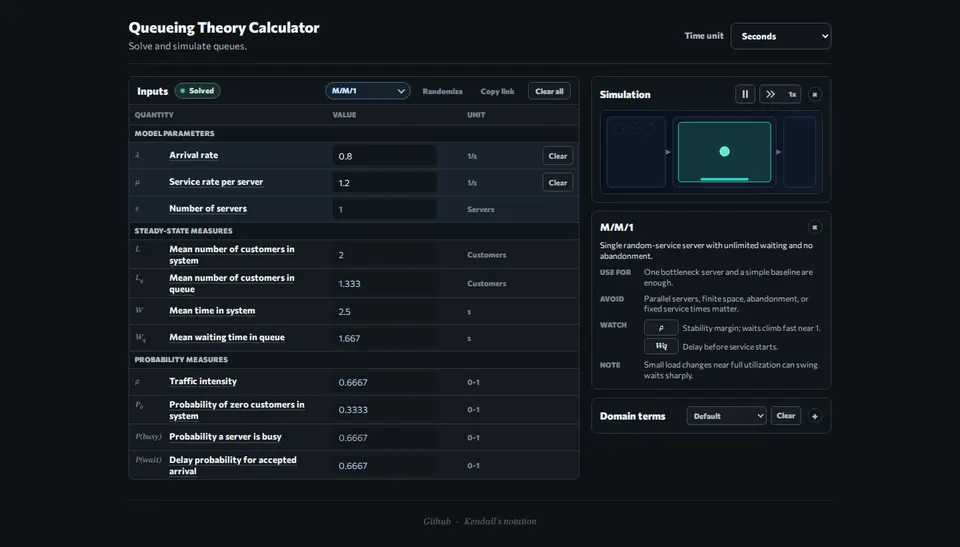

# Queueing Theory Calculator

A small browser tool for exploring queueing systems without a spreadsheet.

Directed by a human; produced by GPT-5.5.



## What It Can Do

- Solve common queueing models: M/M/1, M/M/s, M/M/s/K, M/M/infinity, M/G/1, M/D/1, G/G/s, and Erlang A.
- Fill in queue metrics such as utilization, waiting time, queue length, wait probability, blocking, throughput, and abandonment.
- Work from partial inputs when the model has enough information.
- Switch time units, randomize valid examples, and copy shareable links.
- Show a lightweight discrete-event simulation for solved systems.
- Customize queue terminology for different domains.

## Run Locally

#### Dev server

```bash
pnpm install
pnpm dev
```

#### Static bundle

```bash
pnpm build
```

## License

MIT
